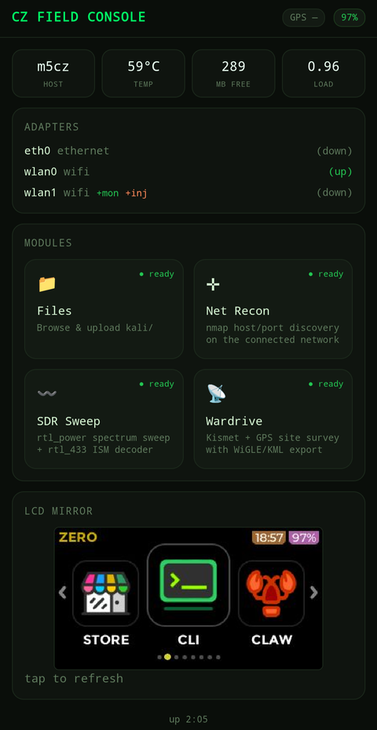
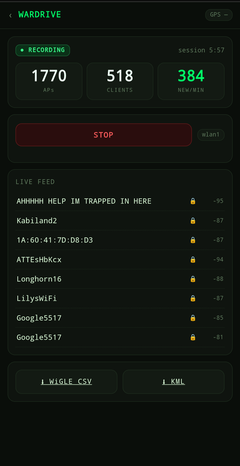
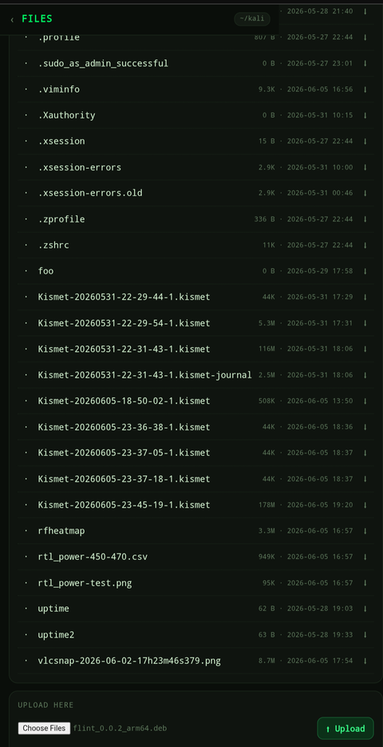

# czconsole

A phone-friendly **field console** for the M5Stack Cardputer Zero — one static
Go binary with strict privilege separation that serves a web UI for driving 
the device, mirrors the onboard LCD to your phone, and hosts capability-gated
**modules** for the things tinkerers actually do on this hardware.

**OS-agnostic by design.** The core runs identically on stock M5 RaspiOS/Pixel
and on the Kali graft. Modules self-detect their dependencies, so the recon /
SDR / wardrive modules light up on Kali (where the tools live) and sit greyed
out on stock RaspiOS until you install them — same binary, same `.deb`.

<p align="center">
  
  
  
</p>

## Architecture

```
        phone browser  ── HTTP/WS ─►  czconsole (Go, on the CZ)
        (renders UI)                    ├─ core: sysinfo, LCD mirror, web term
                                        └─ modules: wardrive, sdr, recon, ... 
                                              ▲ capability-gated
                                              └─ external modules in
                                                 /etc/czconsole/modules.d/
```

- **Core** (always present, any OS): system telemetry (CPU/RAM/temp/battery),
  network-adapter inventory, the `/dev/fb0` LCD mirror, a web terminal.
- **Bundled modules** (compiled in): polished demos that self-disable without
  their tools.
- **External modules** (no recompile): a directory + `module.toml` dropped into
  `modules-dir`, written in any language. See [`docs/MODULE_SPEC.md`](docs/MODULE_SPEC.md).

The front-end renders a module's UI **generically from its manifest** — authors
declare actions, the core supplies the buttons, log pane, and status fields.

## Build

Pure Go, no cgo — cross-compiles from any host with a one-liner:

```sh
GOOS=linux GOARCH=arm64 go build -o czconsole ./cmd/czconsole
```

## Run

```sh
./czconsole --listen :8080
# open the URL it prints from your phone
```

Set `CZCONSOLE_TOKEN` (env or `--auth-token`) to require a shared token on a
shared/untrusted hotspot. Empty = LAN-trusted, no auth.

For real per-user auth, enable the **PAM login** (on by default in the `.deb`).
The worker authenticates device accounts against the system password database
and hands back a signed, `HttpOnly` session cookie — but it never links
`libpam` (that's cgo; the binary stays `CGO_ENABLED=0`) and never reads
`/etc/shadow`. Instead a separate root **auth agent** (`czconsole-auth.service`)
execs `pamtester` over a group-restricted unix socket: the same privsep split
as files and kismet — the worker parses untrusted input and holds no privilege,
the agent holds privilege and parses nothing but `{user,password}`. Toggle it
with `--require-login` in `/etc/czconsole/czconsole.conf`. It needs the
`pamtester` package (a `.deb` dependency; in `kali-rolling/main` and Debian
`trixie/main`). `pam_faillock` gives per-account lockout, a per-IP rate limiter
sits in front, and the shared token above still works alongside it for API
clients.

The three tiers stack: **nothing (LAN-trusted) -> shared token -> PAM login**.

## Install (privsep, two services)

The console runs as **two** systemd services: a deprivileged web worker
(`_czconsole`) and a small files-agent (the operator) bridged by a unix socket —
see the security model below. One-time device setup + install:

```sh
GOOS=linux GOARCH=arm64 CGO_ENABLED=0 go build -o czconsole ./cmd/czconsole   # host
scp czconsole packaging/* kali@cz:/tmp/
ssh kali@cz '
  sudo FILES_USER=kali sh /tmp/setup-privsep.sh                  # users/groups/setcap
  sudo install -m755 /tmp/czconsole /usr/local/bin/czconsole
  sudo install -m644 /tmp/czconsole.service /tmp/czconsole-files.service /etc/systemd/system/
  sudo install -m644 "/tmp/czconsole-kismet@.service" /etc/systemd/system/   # wardrive capture
  sudo install -m644 /tmp/50-czconsole-kismet.rules /etc/polkit-1/rules.d/   # polkit allowlist
  sudo systemctl daemon-reload && sudo systemctl restart polkit
  sudo systemctl enable --now czconsole-files czconsole'
```

## Packaging & release (planned)

The release pipeline will produce a **`.deb`** for one-command install on the
Kali graft and stock RaspiOS alike (both Debian Trixie). Intended shape:

- **Contents:** the cross-built binary, both systemd units, `/etc/czconsole/modules.d/`.
- **`postinst`:** runs the `setup-privsep.sh` logic (create `_czconsole` +
  `czconsole` group, the enumerated group memberships, `setcap` the kismet
  capture helper, state dirs), `daemon-reload`, enable + start both services.
- **`prerm`:** stop + disable; **`postrm` (purge):** remove the system user.
- **`Recommends:`** `kismet gpsd rtl-sdr nmap` — not hard deps, since modules
  self-disable when their tools are absent.
- **Tooling:** likely [`nfpm`](https://nfpm.goreleaser.com/) — it builds `.deb`
  (and `.rpm`) from a YAML manifest on the x86 host, no dpkg toolchain or target
  needed, which fits the pure-Go cross-compile model. A `make release` / CI step
  cross-builds + packages.

Until then, install via the two-service steps above.

## Security model — privilege separation (north-star)

czconsole is a network-facing web service on a *security* device. It must not
be root-by-default. This section is the design target every change should move
toward, not a description of today's code (see **Current state** below).

### The load-bearing rule

> The process that touches untrusted input never holds privilege. The process
> that holds privilege never parses untrusted input. IPC between them carries
> **intentions** (`{action:"wardrive.start", iface:"wlan1"}`), never
> **mechanisms** (`"kismet -c wlan1"` — a shell-injection vector that would
> defeat the whole exercise). The privileged side **re-validates** every field.

A small, auditable privileged component is allowed only to perform narrow, 
enumerated operations on request from a deprivileged worker that owns the entire
attack surface.

### Threat model

Single-operator device. Untrusted input = HTTP from anyone on the same hotspot/LAN.
A network exploit must not trivially yield root.

### Target architecture (who runs as what)

| Component | Runs as | Privilege | Why |
|---|---|---|---|
| Network worker (HTTP, dashboard, sysinfo, GPS, LCD mirror, all module UIs) | `_czconsole` (dedicated, **no sudo**) | groups `video` + `i2c` only | The whole attack surface, hard-deprivileged. `video`/`i2c` are read-only hardware peeks — low value if popped. |
| Files agent | `kali` / `pi` (the operator) | normal user | File ownership can't be faked: writing a `kali`-owned file in `~kali` requires *being* kali or root-then-chown. Runs as its own small process over a unix socket. SFTP-style. |
| Privileged tool actions (kismet capture, monitor-mode setup, raw-socket scans) | see per-tool below | least capability | The only genuinely privileged work; the smallest surface. |

The worker is a no-sudo dedicated user **on purpose**

### Per-tool privilege, in order of preference

1. **File capabilities** (`setcap`) — no sudo, no root process.
   - `nmap` -> `cap_net_raw+eip`
   - `kismet` -> its **own** model: the privileged work is in
     `kismet_cap_linux_wifi` / `_bluetooth`, not the main binary. Run
     `dpkg-reconfigure kismet-capture-common` (setcaps the helpers, creates the
     `kismet` group), put the service user in `kismet`. **Do not** setuid the
     main `kismet` binary — it does no capture and the monitor device won't
     appear. **Do not** pre-`airmon-ng` a `wlanNmon`; hand kismet the *base*
     interface and let its helper create the vif via `CAP_NET_ADMIN`.
   - `rtl_*` -> service user in `plugdev` for USB; no elevation.
2. **Narrow sudo -> root-owned validating wrapper** — only where caps don't
   reach (e.g. monitor-mode setup via `iw`/`airmon-ng`, which wants the broad
   `CAP_NET_ADMIN`). The wrapper *is* the enumerated, validated action.
3. **Full privileged monitor process** — introduce only if the wrapper surface
   grows enough to warrant it. Dedicated-user + caps + wrappers already deliver
   ~90% of the monitor's benefit for ~10% of the code.

### External modules and the privilege boundary

Modules dropped in `modules.d` exec **in the worker** (unprivileged) by default.
Anything privileged must route through one of the enumerated privileged actions
(cap'd tool, wrapper, or monitor). An external module **cannot grant itself
privilege** — the allowlist of privileged actions *is* the boundary.

### Linux analogues to the OpenBSD primitives

| OpenBSD | Linux | Use |
|---|---|---|
| dedicated user + chroot | `User=` + `ProtectSystem=strict` + `ReadWritePaths=` | drop privilege, narrow filesystem |
| `unveil(2)` | **Landlock LSM** (≥5.13); systemd `ProtectHome`/`DeviceAllow` | restrict the worker's visible paths to `~` + the two `/dev` nodes |
| `pledge(2)` | **seccomp-bpf** (`SystemCallFilter=@system-service`) | syscall allowlist after setup (defense-in-depth) |
| `imsg` socketpair | unix socket / socketpair between worker and agent/monitor | the intentions-not-mechanisms IPC |

Much of this is declarative in the systemd unit: `User=`,
`SupplementaryGroups=video i2c`, `CapabilityBoundingSet=`, `NoNewPrivileges=`,
`ProtectSystem=strict`, `DeviceAllow=/dev/fb0 r` + `/dev/i2c-1 rw`,
`DevicePolicy=closed`, `RestrictAddressFamilies=AF_INET AF_INET6 AF_UNIX`.

### Phased rollout — DONE for the base + wardrive

1. **Deprivilege the worker — landed.** Web worker runs as `User=_czconsole`
   (no sudo: on Kali, `kali` has `NOPASSWD: ALL`, so a dedicated powerless user
   is the boundary), supplementary groups `i2c`/`video`/`kismet`/`plugdev`/
   `netdev`/`czconsole`, with `NoNewPrivileges`, empty `CapabilityBoundingSet`,
   `RestrictAddressFamilies=AF_INET AF_INET6 AF_UNIX AF_NETLINK`
   (netlink is read-only here — no `CAP_NET_ADMIN`, so introspection only),
   `ProtectSystem=strict`, `SystemCallFilter=@system-service`. Files runs as a separate `kali` agent over
   a group-restricted unix socket (uploads now land `kali`-owned).
2. **First privileged module = first boundary — landed (wardrive).** The crux
   lesson: a child of the hardened worker **inherits and cannot escape** the
   worker's sandbox (empty caps, restricted address families), so kismet *cannot*
   run as a worker child — it needs `CAP_NET_ADMIN`/`CAP_NET_RAW` +
   `AF_NETLINK`/`AF_PACKET`. The fix is the privsep model realized with stock
   tools: kismet runs in its **own** unit (`czconsole-kismet@<iface>.service`)
   with exactly those scoped privileges, and the worker triggers it via a
   **narrow polkit rule** (`systemctl start/stop czconsole-kismet@*`). systemd is
   the monitor; the polkit allowlist is the enumerated action; no setuid (so it
   works under `NoNewPrivileges`); the worker holds zero net capability yet
   drives a privileged capture. kismet itself captures unprivileged via its
   setcap'd `kismet_cap_linux_wifi` helper + the `kismet` group.
3. **Login (PAM) — landed, the third privsep boundary.** The worker authenticates
   users against the system password database, but **never links libpam** (that's
   cgo; the binary is `CGO_ENABLED=0`) and **never reads `/etc/shadow`**. Instead
   a separate **auth agent** (`czconsole-auth.service`, the only czconsole process
   that runs as root) listens on a group-restricted unix socket and execs
   `pamtester czconsole <user> authenticate` — the real PAM stack
   (`/etc/pam.d/czconsole`, with `pam_faillock`). Same split as files/kismet: the
   worker parses untrusted input and holds no privilege; the agent holds privilege
   and parses nothing richer than `{user,password}`. On success the worker issues
   an HMAC-signed, per-process-secret session cookie (`HttpOnly; SameSite=Strict`);
   a per-IP rate limiter sits in front of faillock. `pamtester` is a package
   dependency (`kali-rolling/main` + Debian `trixie/main`, same version), so it's
   pulled automatically by the `.deb`. Secure-by-default: login is on unless
   `/etc/czconsole/czconsole.conf` is blanked.
4. **Defense in depth (next)** — Landlock the worker's filesystem view, tighten
   seccomp further, per-tool capability scoping for the remaining modules.

### Current state

Base console + Files + wardrive run **fully deprivileged** as above — the binary
is never root. The remaining modules (sdr, netrecon) are placeholders; when they
land, each privileged tool follows the per-tool order (caps -> scoped unit +
polkit -> wrapper), never the hardened worker. Phase 3 hardening is the open item.

## Status

Working MVP, **fully deprivileged** (never runs as root):

- **Core**: dashboard, LCD mirror, sysinfo (CPU/RAM/temp/battery via i2c, GPS via
  gpsd), adapter inventory with driver-inferred `+mon`/`+inj` capability flags.
- **Files**: browse + streaming upload, path-jailed, via the `kali` files-agent
  (correct ownership).
- **Wardrive**: kismet capture in a polkit-scoped unit, live AP/client counts +
  SSID feed via kismet REST, gpsd-tagged, WiGLE CSV + KML export (needs a GPS fix
  to produce geo data). Worker stays minimal; privilege lives in the kismet unit.
- **sdr, netrecon**: placeholder tiles (self-disable without their tools).

- **Login**: optional PAM auth (on by default) via a root auth agent that execs
  `pamtester` — no libpam linked, no shadow access in the worker. Signed session
  cookie + per-IP rate limit; `pam_faillock` lockout.

Three services (`czconsole`, `czconsole-files`, `czconsole-auth`) + the
per-interface `czconsole-kismet@` unit. Pure-Go, cross-compiles with one command.
MIT licensed. Packaged as a `.deb` via nfpm (`packaging/nfpm.yaml`,
Depends: `pamtester`).
